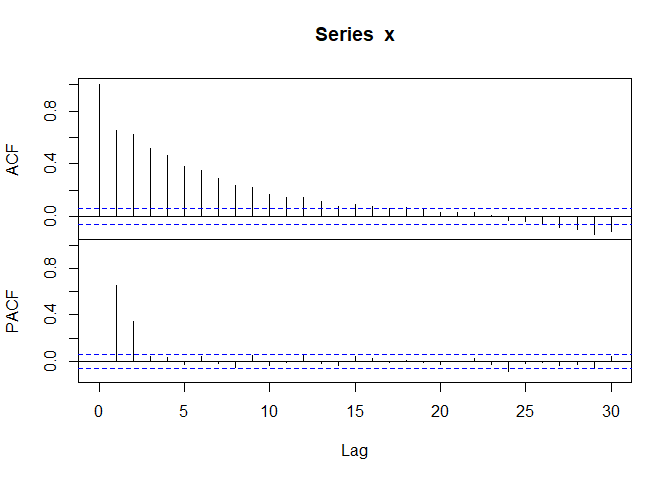

<!-- README.md is generated from README.Rmd. Please edit that file -->
Acf
===

This package provides a wrapper for R functions `acf` and `pacf` for simultaneous plotting of acf and pacf.

Installation
------------

You can install the released version of Acf from [CRAN](https://CRAN.R-project.org) with:

``` r
install.packages("Acf")
```

Example
-------

Let's test `Acf` on an MA(2) series which plots its acf and pacf.

``` r
library(Acf)
e <- rnorm(100)
x <- filter(e, c(.5, -.3), sides=1)[-1]
Acf(x)
```


